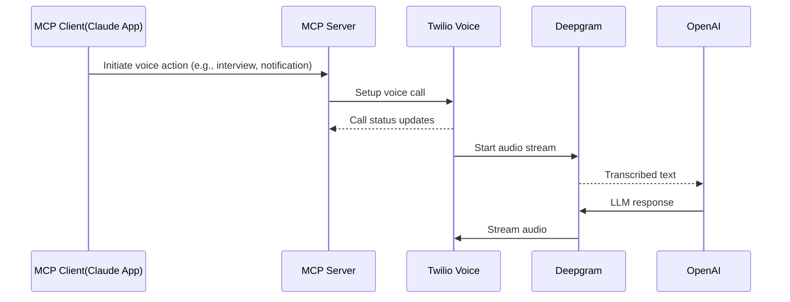

# Voice Assistant MCP Server

A powerful **Model Context Protocol (MCP) server** that integrates **Twilio Voice**, **Deepgram AI**, and **OpenAI** to create intelligent voice-based HR automation tools. This system enables AI assistants like Claude to conduct phone interviews, deliver notifications, and manage HR communications through natural voice conversations.

## Features

### Core Capabilities

- **AI-Powered Voice Interviews**: Conduct professional phone interviews with candidates using AI
- **Interview Result Notifications**: Automatically call candidates with interview results and feedback
- **Job Opportunity Outreach**: Reach out to potential candidates about new positions
- **Real-time Voice Processing**: Powered by Deepgram’s Voice Agent API
- **MCP Integration**: Seamless integration with Claude and other MCP-compatible AI assistants

### Technical Features

- **WebSocket-based Media Streaming**: Real-time audio processing with Twilio Media Streams
- **Dynamic Prompt Injection**: Contextual AI prompts based on call purpose
- **Function Call Handling**: Advanced AI function calling for call management
- **Comprehensive Logging**: Detailed logging for debugging and monitoring
- **Environment Configuration**: Secure credential management

## Architecture



## Prerequisites

Before setting up the project, ensure you have:

1. **Node.js** (v22 or higher)
2. **Twilio Account** with:
   - Account SID
   - Auth Token
   - Phone Number (for outbound calls)
3. **Deepgram Account** with API Key
4. **Public URL** (ngrok or production server) for webhooks

## Installation

1. **Clone the repository**:

   ```bash
   git clone https://github.com/prakharbhardwaj/voice-agent-mcp-server.git
   cd voice-agent-mcp-server
   ```

2. **Install dependencies**:

   ```bash
   npm install
   ```

3. **Environment Configuration**:
   Create a `.env` file in the root directory:

   ```env
   # Server Configuration
   PORT=3000
   SERVER_URL=your_ngrok_url_or_server_url

   # Twilio Credentials
   TWILIO_ACCOUNT_SID=your_twilio_account_sid
   TWILIO_AUTH_TOKEN=your_twilio_auth_token
   TWILIO_PHONE_NUMBER=+your_twilio_phone_number

   # Deepgram API Key
   DEEPGRAM_API_KEY=your_deepgram_api_key
   ```

4. **Configure MCP Server**:
   Update `mcp-config.json` with your actual paths and credentials:
   ```json
   {
     "mcpServers": {
       "voice-agent-mcp-server": {
         "type": "stdio",
         "command": "node",
         "args": ["/path/to/your/voice-agent-mcp-server/mcp-server.js"],
         "env": {
           "NODE_ENV": "production",
           "SERVER_URL": "your_ngrok_url_or_server_url",
           "TWILIO_ACCOUNT_SID": "your_twilio_account_sid",
           "TWILIO_AUTH_TOKEN": "your_twilio_auth_token",
           "TWILIO_PHONE_NUMBER": "+your_twilio_phone_number"
         }
       }
     }
   }
   ```

## Usage

### Start the Web Server

```bash
npm run dev
```

### Using with Claude Desktop

1. Add the MCP server configuration to Claude Desktop's settings:
   - For macOS: `~/Library/Application Support/Claude/claude_desktop_config.json`
   - For Windows: `%APPDATA%\Claude\claude_desktop_config.json`
2. Restart Claude Desktop
3. Use the available tools in your conversation with Claude

### Available MCP Tools

#### 1. `conduct_interview`

Initiate a voice call to conduct a professional interview with a candidate.

**Parameters:**

- `candidatePhone` (string): Phone number in E.164 format
- `candidateName` (string): Name of the candidate
- `position` (string): Position they're applying for
- `interviewQuestions` (array): List of questions to ask

**Example:**

```
Conduct an interview with John Doe at +1234567890 for the Software Engineer position.
Ask about their experience with React, their problem-solving approach, and their career goals.
```

#### 2. `notify_interview_result`

Call a candidate to inform them about their interview results.

**Parameters:**

- `candidatePhone` (string): Phone number in E.164 format
- `candidateName` (string): Name of the candidate
- `position` (string): Position they interviewed for
- `result` (enum): "accepted", "rejected", or "next_round"
- `message` (string): Additional feedback message

**Example:**

```
Call Jane Smith at +1234567890 to let her know she's been accepted for the Product Manager role.
```

#### 3. `discuss_job_opening`

Reach out to potential candidates about job opportunities.

**Parameters:**

- `candidatePhone` (string): Phone number in E.164 format
- `candidateName` (string): Name of the potential candidate
- `position` (string): Job position to discuss
- `companyInfo` (string): Brief company and role information
- `nextSteps` (string): Next steps if interested

#### 4. `get_call_status`

Get the status of active voice calls and system health.

#### 5. `check_twilio_config`

Verify Twilio configuration and service readiness.

## Project Structure

```
├── index.js                   # Main Fastify server
├── mcp-server.js              # MCP server implementation
├── mcp-config.json            # MCP configuration
├── package.json               # Dependencies and scripts
└── src/
    ├── SettingsConfiguration.js   # Deepgram agent settings
    ├── config/
    │   └── dotenv.js              # Environment configuration
    ├── mcp/
    │   ├── logger.js              # Logging utilities
    │   ├── prompts.js             # AI prompt generators
    │   ├── server.js              # MCP server logic
    │   └── tools.js               # MCP tool definitions
    ├── routes/
    │   └── twilioRoute.js         # Twilio webhook handlers
    ├── services/
    │   ├── functionCallHandler.js # AI function call processing
    │   └── twilioService.js       # Twilio API wrapper
    └── websockets/
        └── mediaStreamHandler.js  # WebSocket media processing
```

## Configuration Details

### Deepgram Agent Settings

The system uses Deepgram's Voice Agent with:

- **Speech Recognition**: Nova-3 model
- **Text-to-Speech**: Aura-2 Asteria voice
- **LLM Integration**: OpenAI GPT-4o-mini
- **Audio Format**: μ-law encoding at 8kHz (Twilio compatible)

### Twilio Integration

- **Media Streams**: Real-time audio streaming via WebSocket
- **TwiML**: Dynamic call routing with custom parameters
- **Call Management**: Status tracking and call control

## Troubleshooting

### Common Issues

1. **Twilio webhook not receiving calls**:

   - Ensure your SERVER_URL is publicly accessible
   - Check ngrok is running and URL is updated
   - Verify TwiML configuration

2. **Deepgram connection issues**:

   - Validate DEEPGRAM_API_KEY
   - Check WebSocket connectivity
   - Review audio format compatibility

3. **MCP server not loading in Claude**:
   - Verify mcp-config.json paths are absolute
   - Check all environment variables are set
   - Restart Claude Desktop after configuration changes

### Debugging

Enable detailed logging by checking the console output and `src/mcp/mcp-server.log` file.

## Development

### Running in Development Mode

```bash
# Start web server with auto-reload
npm run dev
```

### Adding New Tools

1. Define the tool in `src/mcp/tools.js`
2. Add prompt generation logic in `src/mcp/prompts.js`
3. Implement tool handler in `src/mcp/server.js`

## Security Considerations

- Store all credentials in environment variables
- Use HTTPS/WSS in production
- Validate phone numbers and input data
- Implement rate limiting for production use
- Follow Twilio security best practices

## Contributing

1. Fork the repository
2. Create a feature branch
3. Make your changes
4. Add tests if applicable
5. Submit a pull request

## Known Issues

### ES Module Compatibility with Claude Desktop

If you encounter `SyntaxError: Unexpected identifier` when using this MCP server with Claude Desktop, this is due to Claude Desktop not having access to the same PATH environment or working directory context as your terminal.

**Root Cause**: Claude Desktop may not find the same Node.js binary that you use in your terminal (especially with nvm), or it may not run from the project directory where it can find the `package.json` with `"type": "module"`.

**Solution**: Use the absolute path to your Node.js binary in your Claude Desktop configuration:

```json
{
  "mcpServers": {
    "voice-agent-mcp-server": {
      "type": "stdio",
      "command": "/Users/yourusername/.nvm/versions/node/v22.16.0/bin/node",
      "args": ["/path/to/your/project/mcp-server.js"],
      "env": {
        // ... your environment variables
      }
    }
  }
}
```

**Key points:**

- Use absolute path to Node.js binary (find yours with `which node`)
- Set `cwd` to your project directory so Node.js can find `package.json`
- This ensures Claude Desktop uses the correct Node.js and project context

**Related Issue**: [MCP Servers Issue #64](https://github.com/modelcontextprotocol/servers/issues/64)

## Support

For issues and questions:

1. Check the troubleshooting section
2. Review logs in `src/mcp/mcp-server.log`
3. Open an issue on the repository

---

**Built using Twilio, Deepgram, and the Model Context Protocol**
